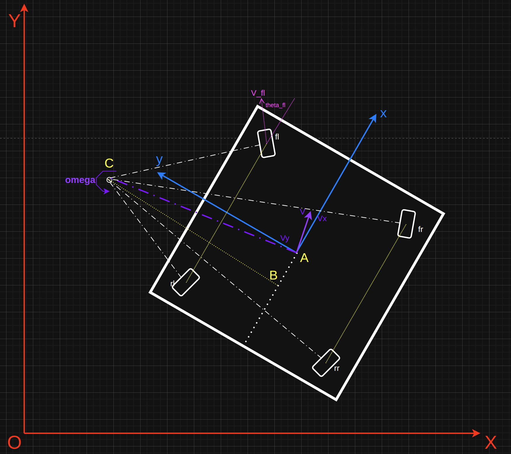
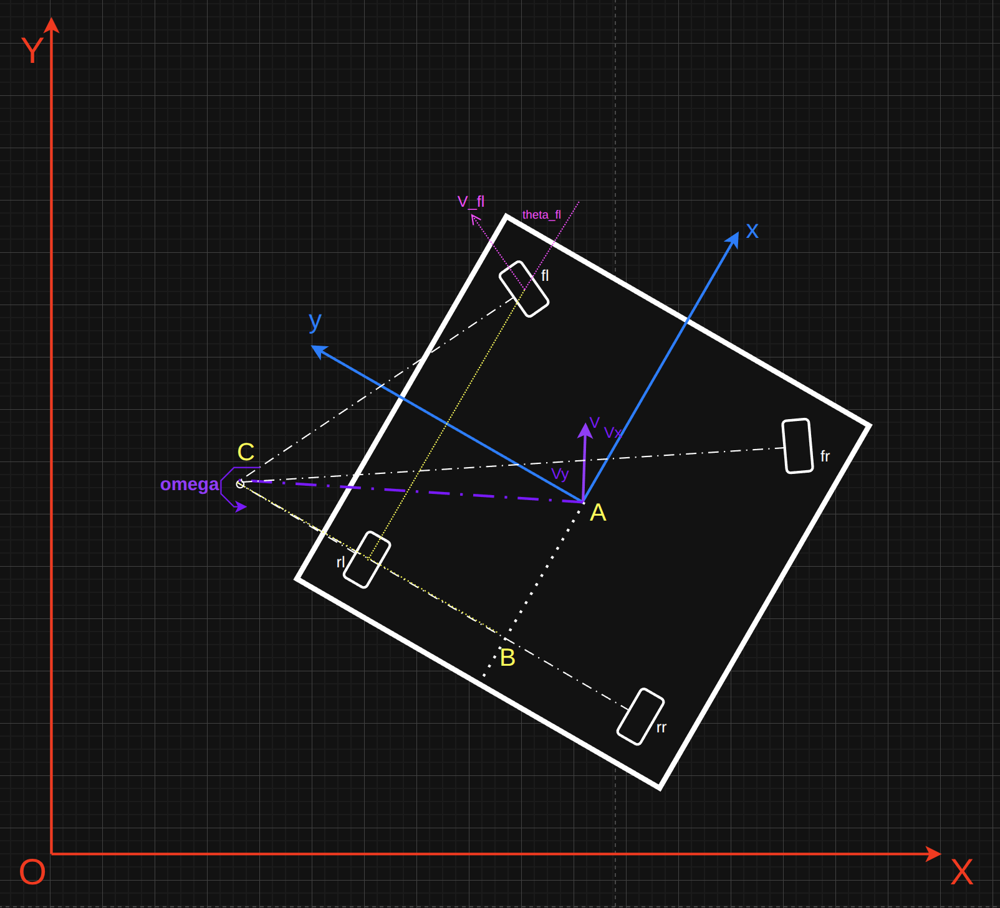

本文分析四舵轮移动机器人底盘的运动学逆解。

四舵轮底盘拥有8个自由度，每个舵轮都是双关节结构，分为舵轮的旋转和舵轮驱动轮的转动。由此，四舵轮底盘可以产生**原地旋转、蟹行的平动、两后轮保持前向固定而两前轮转动的传统阿克曼结构、以及后轮参与转向的双阿克曼结构**这四种运动方式。

运动学逆解是根据输入的机器速度$v_x$， $v_y$， $w$，反推四舵轮的角度和转速。
这里先分析双阿克曼结构，分析完会发现双阿克曼的运动学模型可以退化成其他几种。

## 双阿克曼结构运动学分析图

运动学分析图如下（图丑，将就看）：



如图可见我的四舵轮分布在底盘正方形的四个定点上，并分别以$fl, fr, rl, rr$命名。轮间距定义为$H$，如图中$fl-rl$的黄色虚线所示距离。当然，也存在四舵轮分布呈现矩形的方式，计算过程一样，只是稍微复杂。

双阿克曼结构运动时会有一个瞬时运动中心C点，该点与四个舵轮的连线，与舵轮方向垂直；并且，C与运动学中心A的连线，与机器人的线速度方向垂直。这是我们分析运动学的关键。

定义世界坐标系$XOY$，如图中红色所示。
定义机器人坐标系中的坐标$xAy$，如图中蓝色所示，满足右手定则。机器人运动学中心为A点。
在机器人坐标系中，$x$轴指向机器人正前方，$y$轴指向机器人左侧，则对应的前向速度设置为$v_x$，左侧速度设置为$v_y$，角速度为$w,(图中为omega)$，如图中紫色所示。$V$表示机器人运动学中心的真实线速度，它与机器人正前方是存在夹角的，称之为滑移角，计算方式为$\tan\theta=\frac{v_y}{v_x}$，图中并未标出。

以左前舵轮为例，定义舵轮的线速度和转角分别为$V_{fl}$, $\theta_{fl}$，其他三个类似。

至此，运动学定义完毕，下面开始计算。


## 双阿克曼模式运动学逆解
首先关注两个距离：$AB$和$BC$，以下分析会重点用到。

下面先分析四个舵轮的线速度和转角与$AB$和$BC$的关系：
还是以左前舵轮为例，假设左前轮$fl$到$C$点的距离为$L_{C-fl}$，则有：
$V_{fl}$ = $w$ * $L_{C-fl}$。
由几何关系又可得：
$L_{C-fl}$ = $\sqrt{(AB+H)^2 + (BC - H)^2}$
图画的不好，但这里也容易理解。
那么，我们就得到了舵轮线速度和$AB$与$BC$的关系：

$V_{fl}$ = $w$ * $\sqrt{(AB+H)^2 + (BC - H)^2}$

又几何关系也很容易可以看出转角的计算公式：

$\theta_{fl}$ = $\arctan\frac{AB+H}{BC-H}$ 这里需要注意方向，这样算出来的两个前轮是对的，但后轮算出来要加负号，可以理解下。

注意，这里算出的角度不能用于计算机计算，code的时候应该用$atan2()$函数。
其他三个舵轮的线速度和转角也类似，不再赘述。

可以看到，舵轮的转角和速度是跟$AB$和$BC$有关的，而$AB$和$BC$又如何由已知量$v_x$， $v_y$， $w$推导出来呢，继续：

机器线速度有如下关系：

$V = \sqrt{v_x^2 + v_y^2}$ = $w$ * $AC$ = $w$ * $\sqrt{AB^2 + BC^2}$

则可得：

$AB^2 + BC^2$ = $\frac{v_x^2 + v_y^2}{w^2}$

再由滑移角的计算可得：

$\tan\theta = \frac{v_y}{v_x}$ = $\frac{AB}{BC}$

联立上两式可得：

$AB = \frac{v_x}{w}$ , $BC = \frac{v_y}{w}$

这时，消去$AB$和$BC$，就得到了四舵轮转角和线速度，与输入的机身速度$v_x$， $v_y$， $w$之间的关系：

$
\begin{cases}
V_{fl} =  \sqrt{(V_x - Hw)^2 + (Hw + V_y)^2}  \\
V_{fr} =  \sqrt{(V_x + Hw)^2 + (Hw + V_y)^2}  \\
V_{rl} =  \sqrt{(V_x - Hw)^2 + (Hw - V_y)^2}  \\
V_{rr} =  \sqrt{(V_x + Hw)^2 + (Hw - V_y)^2}  
\end{cases}
$

$
\begin{cases}
\theta_{fl} =  \arctan2\frac{V_y + Hw}{V_x - Hw}  \\
\theta_{fr} =  \arctan2\frac{V_y + Hw}{V_x + Hw}  \\
\theta_{rl} =  \arctan2\frac{V_y - Hw}{V_x - Hw}  \\
\theta_{rr} =  \arctan2\frac{V_y - Hw}{V_x + Hw}  
\end{cases}
$

应该是写对了，代码也贴上，代码是对的：

```
void FourSteeredWheeledRobot::inverseKinematics(double Vx, double Vy, double Omega, std::array<double, 4>& target_steer, std::array<double, 4>& target_drive) {
    double h = CHASSIS_HALF_WIDTH;
    double hw = h * Omega;

    target_steer = {
        std::atan2((Vy + hw), (Vx - hw)),
        std::atan2((Vy + hw), (Vx + hw)),
        std::atan2((Vy - hw), (Vx - hw)),
        std::atan2((Vy - hw), (Vx + hw))
    };

    target_drive = {
        std::sqrt(std::pow(Vx - hw, 2) + std::pow(hw + Vy, 2)) / WHEEL_RADIUS,
        std::sqrt(std::pow(Vx + hw, 2) + std::pow(hw + Vy, 2)) / WHEEL_RADIUS,
        std::sqrt(std::pow(Vx - hw, 2) + std::pow(hw - Vy, 2)) / WHEEL_RADIUS,
        std::sqrt(std::pow(Vx + hw, 2) + std::pow(hw - Vy, 2)) / WHEEL_RADIUS
    };
}
```
至此，双阿克曼结构的运动学逆解分析完毕。

我们用webots仿真来验证一下：

<video controls src="四舵轮双阿克曼运动.mp4" title="Title"></video>

>从视频可以发现后退时舵轮有时转角非常大，导致切换不丝滑，这是因为我们设定了舵轮的转角范围是$[-\pi, \pi]$，而舵轮驱动轮的速度总是非负。所以前进时舵轮角度为0，速度为正，后退时舵轮角度为$\pi$，速度还是为正，这样舵轮转角就很大。后续可以通过一个转换函数来将舵轮转角限制在$[-\pi/2, \pi/2]$范围内，速度则可以取负，这样舵轮的转动就平滑了。

下面看看套这个公式会不会直接得出其他几种运动学模型的公式：

## 自旋模式运动学逆解

自旋模式下，机器人只有角速度$w$，线速度$v_x = 0$，$v_y = 0$. 套公式可得：

$
\begin{cases}
V_{fl} =  \sqrt{2}H * w  \\
V_{fr} =  \sqrt{2}H * w  \\
V_{rl} =  \sqrt{2}H * w  \\
V_{rr} =  \sqrt{2}H * w  
\end{cases}
$

$
\begin{cases}
\theta_{fl} =  \arctan2\frac{w}{-w}\\
\theta_{fr} =  \arctan2\frac{w}{w}  \\
\theta_{rl} =  \arctan2\frac{-w}{-w}  \\
\theta_{rr} =  \arctan2\frac{-w}{w}  
\end{cases}
$

当$w>0$时，机器逆时针旋转，此时四舵轮角度为$
\begin{cases}
\theta_{fl} =  135°\\
\theta_{fr} =  45°  \\
\theta_{rl} =  -135°  \\
\theta_{rr} =  -45°  
\end{cases}
$

当$w<0$时，机器顺时针旋转，此时四舵轮角度为$
\begin{cases}
\theta_{fl} =  -45°\\
\theta_{fr} =  -135°  \\
\theta_{rl} =  45°  \\
\theta_{rr} =  135°  
\end{cases}
$

上述公式是不是退化成了自旋模型！

我们用webots仿真来验证一下：

<video controls src="四舵轮自旋.mp4" title="Title"></video>

## 蟹行模式运动学逆解

蟹行模式下，机器人只有速度$v_x$和$v_y$，姿态不变故$w = 0$. 套公式可得：

$
\begin{cases}
V_{fl} =  \sqrt{(V_x)^2 + (V_y)^2} = V  \\
V_{fr} =  \sqrt{(V_x)^2 + (V_y)^2} = V  \\
V_{rl} =  \sqrt{(V_x)^2 + (-V_y)^2} = V  \\
V_{rr} =  \sqrt{(V_x)^2 + (-V_y)^2} = V  
\end{cases}
$

$
\begin{cases}
\theta_{fl} =  \arctan2\frac{V_y}{V_x} = \theta  \\
\theta_{fr} =  \arctan2\frac{V_y}{V_x} = \theta  \\
\theta_{rl} =  \arctan2\frac{V_y}{V_x} = \theta  \\
\theta_{rr} =  \arctan2\frac{V_y}{V_x} = \theta  
\end{cases}
$

四轮的速度即车体的速度$V$，四轮的转角即车体的滑移角$\theta$。

上述公式是不是退化成了蟹行模型！

我们用webots仿真来验证一下：

<video controls src="2026-04-02 10-19-18.mp4" title="Title"></video>

## 常规阿克曼模式运动学逆解

当两个后轮保持前向固定而两个前轮转动时，机器人运动学模型为常规阿克曼模型。
那么此时的运动学模型如下：



从图中可以看出：

$
\begin{cases}
\theta_{rl} = 0  \\
\theta_{rr} = 0 
\end{cases}
$

再套公式有：

$
\begin{cases}
\theta_{rl} = 0 = \arctan2\frac{V_y - Hw}{V_x - Hw}  \\
\theta_{rr} = 0 = \arctan2\frac{V_y - Hw}{V_x + Hw}  
\end{cases}
$

得 $V_y = Hw$，此时公式变为：

$
\begin{cases}
V_{fl} =  \sqrt{(V_x - Hw)^2 + (2Hw)^2}  \\
V_{fr} =  \sqrt{(V_x + Hw)^2 + (2Hw)^2}  \\
V_{rl} =  V_x - Hw  \\
V_{rr} =  V_x + Hw
\end{cases}
$

$
\begin{cases}
\theta_{fl} =  \arctan2\frac{2Hw}{V_x - Hw}  \\
\theta_{fr} =  \arctan2\frac{2Hw}{V_x + Hw}  \\
\theta_{rl} =  0  \\
\theta_{rr} =  0  
\end{cases}
$

似乎看起来并不明显。因为传统阿克曼模型的输入为速度$V$和滑移角$\theta$。我们用仿真来看：

<video controls src="四舵轮传统阿克曼模式.mp4" title="Title"></video>

是不是退化成了传统阿克曼模型！

## 总结
四舵轮转角和线速度，与输入的机身速度$v_x$， $v_y$， $w$之间的通用公式：

$
\begin{cases}
V_{fl} =  \sqrt{(V_x - Hw)^2 + (Hw + V_y)^2}  \\
V_{fr} =  \sqrt{(V_x + Hw)^2 + (Hw + V_y)^2}  \\
V_{rl} =  \sqrt{(V_x - Hw)^2 + (Hw - V_y)^2}  \\
V_{rr} =  \sqrt{(V_x + Hw)^2 + (Hw - V_y)^2}  
\end{cases}
$

$
\begin{cases}
\theta_{fl} =  \arctan2\frac{V_y + Hw}{V_x - Hw}  \\
\theta_{fr} =  \arctan2\frac{V_y + Hw}{V_x + Hw}  \\
\theta_{rl} =  \arctan2\frac{V_y - Hw}{V_x - Hw}  \\
\theta_{rr} =  \arctan2\frac{V_y - Hw}{V_x + Hw}  
\end{cases}
$

